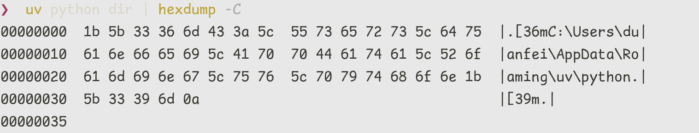

- Windows 下  `uv python dir` 的输出 bug
	- 问题似乎出现在 `anstream`  https://github.com/rust-cli/anstyle/tree/main/crates/anstream
	- uv 使用这个库来检查终端是否支持颜色和 ANSI，使用 `TERM` 这个变量
	- 当我们将 `uv python dir` 重定向出来时，会看到颜色的 ANSI 被打印出来了。
	- 但是 uv 使用 `anstream` 对输出重定向做了检查，如果检查到重定向时是不会输出颜色的ANSI 的，该检测在 Windows 下并没有生效，所以导致了当我使用 `pdm config python.install_root $(uv python dir)` 的配置时，将带有 ANSI 字符的路径写入了配置文件
	- {:height 151, :width 748}