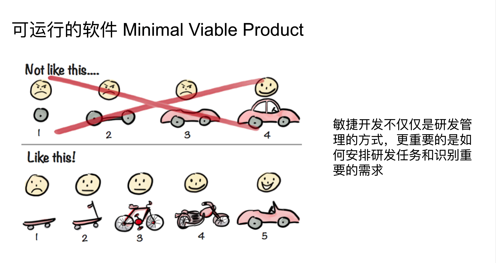
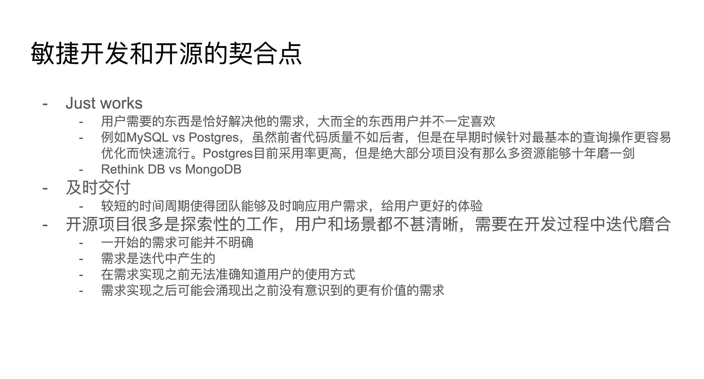

- https://twitter.com/hao520/status/863971655193735168?s=20&t=LFeohPR4MLddmIXB5OhlzQ
- 这是没有太多印象的一年。很幸运，躲过了诸多封控政策，相比于他人而言，被封在家里的时间比较少，就这样到了如今所说的"放开"的时候。
- ## 工作
  heading:: 2
	- 又是一年意义与真理的探究时刻，我意识自己已经没有太多心力去解决基础的问题，也没有耐心应对别人的基础问题，职业本身就是门槛。做好自己的事情，寻求更广泛的认识，才是我应该做的事情。
	  
	  自我怀疑有着巨大的力量，在漫长时间里人们不断被消磨，再赋予某种借口。产品的思路是面对未知的东西，用最小的成本做 MVP 去验证它，没有人能写出来一版就通用的代码，但是代码可以通过不断重构来让它变的更通用，产品也是如此，快速验证，快速迭代。如果我需要巨大的两三个月的时间来验证一个东西，这毫无意义，浪费生命。执着于以往跟执着于现在都没有必要，什么刀切肉快用什么，问题是，那么多刀不全凭平时积累吗？
	  
	  失去了高效率的优势，无非是早作死跟晚作死的区别，覆巢之下，焉有完卵的道理，还需要多说吗。
	-
	- ### 设计不再是一种障碍
	  heading:: 3
	- [refactoring ui](https://www.refactoringui.com/) 这本书做了很好的总结。如今我几乎达到了自己的瓶颈上，对于结构、空间、点线面的理解也到头了，能够组织出合理的 Web 应用来提供所需要的服务，未来几年也很难在这上面有进步了吧。
	-
	- ### 开源社区工作
	  heading:: 3
	- 基于以上对于设计的理解，给[envd](https://github.com/tensorchord/envd)做了一点微小的工作
	- 年初的时候看到高策从腾讯离职，开始做 AI Infra 方面的事情，正好那段时间我也在服务器上搞容器的东西。后来看着他们建立项目、开放代码跟文档、在工程管理上的实践以及技术分享，大概是我完整的经历的第一个开源项目从建立到成型的过程。
	- 在这其中比较“我们差在哪里”这个问题没有太大意义，我最终认识到：菜，是没有办法的。组织形态的问题只有在人的平均水平相差不大的时候才能看出来，效率差太多啥组织形态都没用  ... 这在科技公司的领域差异尤其明显，Gihub 上有无尽的工具来解决各种问题，拿来主义能够发挥最大作用，一个站在前人肩膀上的团队跟个人能够发挥的效率十倍于别人。
	-
	- ### 我们应该以何种方式开发软件
	  heading:: 3
	- https://docs.google.com/presentation/d/1LH6tWyXuROv5qTg7NwtCv5RMiz-lU9mUMV_VZDCTUsU/edit#slide=id.p
	- 传统的版本迭代模型意味着需求分析、设计、编码、测试、一次交付的过程，以为固定需求范围然后按照范围分解任务，逐步实现是理所当然的。但是每个人对于需求的理解、对结构的把握、对实现的要求都是可变因素，所谓编码是创造性的工作就体现在这些方面。在开发范围固定，成本和时间为开发范围服务的模式中，难以预估时间、需要花费大量的时间来检查每一步是否偏离，沟通确认各方的理解是否一致。这在小团队中是不可承受的成本。
	- **Scrum**：**以交付可运行的功能为目标来开发软件**，面向时间来制定计划。这意味着在每个迭代周期（1or2 周）结束之后的功能是可交付状态，再由可交付的功能来组成项目/产品的最终形态。
	- {:height 404, :width 747}
- 
- ## 生活
  heading:: 2
	- ### 有了女友
	  heading:: 3
	- 大概前女友跟现女友是同一个人的情况也不多见，安晓存在给了我极大的心理安慰，人都尤其优势，有其劣势，在毫无必要的事情上妥协，在需要坚持的时候多沟通才是长久之道。
	-
	- ### 十年之前
	  heading:: 3
	- 十年前的 10 月，我来到了北京，当时甚至不知道那个站叫西二旗。
	-
	- ### 读书
	  heading:: 3
	- 在观念形成之后，抛弃了大多数之前看的书，社会学心理学哲学等等等。专注于计算机方面的东西，还有一部分体验设计、游戏设计的。
	- 北京政策严密的几天，重温了王小波的一些书，我的精神家园、思维的乐趣、革命时期的爱情
	- 出差的路上，读完了任天堂体验设计
	- 跟女朋友同看一本，读完了真幌站前多田便利屋、强风吹拂。
	  > 可惜这个方式没有坚持下去
	-
	- ### 游戏
	  heading:: 3
	- 艾尔登法环，神坛迅速跌向宫崎英高
	- 对马岛之魂，美国人做的东方游戏